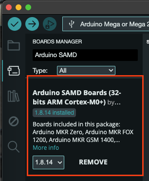
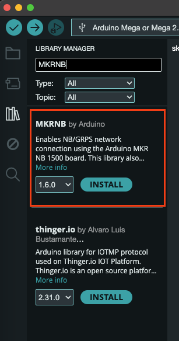
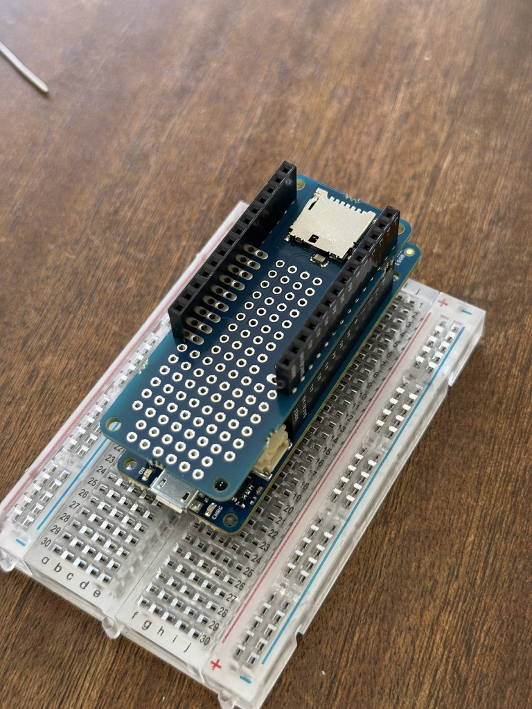
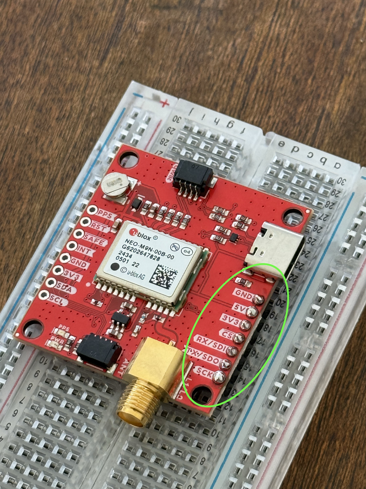
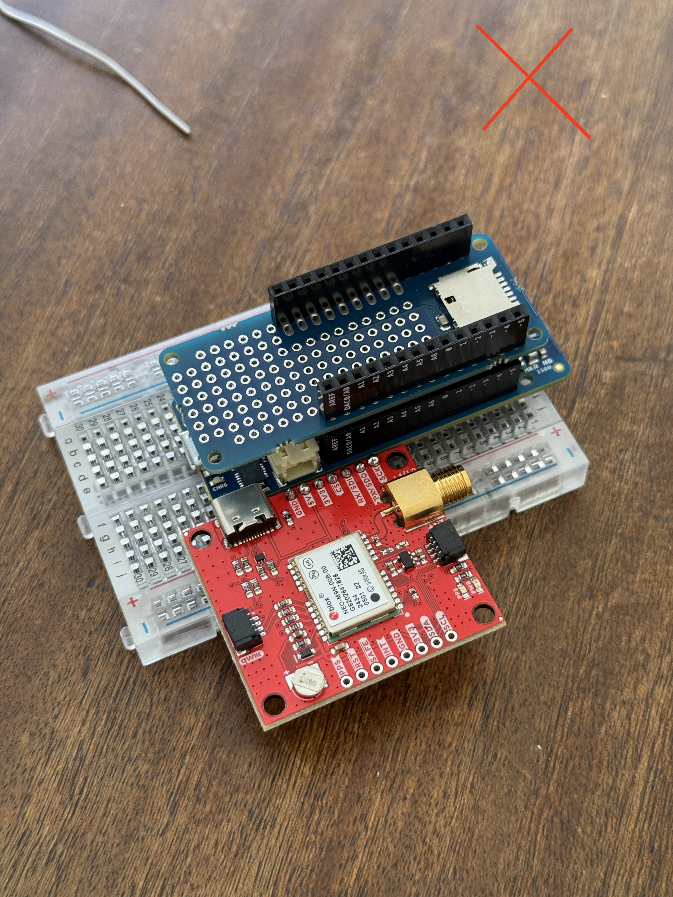
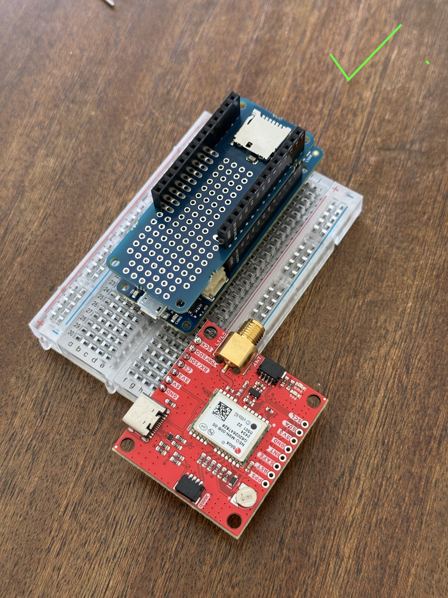
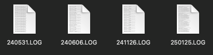

# Build Tutorial for SNR based GNSS Reflectometry (GNSS-R) Project

## Contributors
- [Baxter Pollard](mailto:baxter.b.pollard@gmail.com)
- [Ajay Quirk](mailto:quirkajay@myvuw.ac.nz)
- [Craig Jefferies](mailto:jefferiesc@mtaspiring.school.nz)
- [Delwyn Moller](mailto:delwyn.moller@auckland.ac.nz)
- [Brain Pollard](mailto:bpollard@restorelab.co.nz)

Last updated on the 14th of February 2025

Based on Fagundes, M.A.R., Mendonça-Tinti, I., Iescheck, A.L. et al. An open-source low-cost sensor for SNR-based GNSS
reflectometry: design and long-term validation towards sea-level altimetry. GPS Solut 25, 73 (2021).
https://doi.org/10.1007/s10291-021-01087-1

## Table of Contents
- [Parts](#parts)
- [1. Arduino Firmware](#1-preparing-arduino)
  - [1.1 Arduino IDE Setup](#11-arduino-ide-setup)
  - [1.2 Format the SD Card](#12-format-the-sd-card)
  - [1.3 Uploading the Firmware](#13-uploading-the-firmware)
- [2. Connecting the Electronics](#2-connecting-the-electronics)
  - [2.1 Connecting the Arduino and SD Shield](#21-connecting-the-arduino-and-sd-shield)
  - [2.2 Connecting the Arduino and GPS Module](#22-connecting-the-arduino-and-gps-module)
  - [2.3 Cellular Connection](#23-cellular-connection)
  - [2.4 Preparing the Power System](#24-preparing-the-power-system)
- [3. Mounting the system](#3-mounting-the-system)
- [4. Testing the system](#4-testing-the-system)
  - [4.1 Activity LEDs](#41-activity-leds)
  - [4.2 Serial Monitor](#42-serial-monitor)
  - [4.3 Data Files](#43-data-files)
# Parts
The parts list can be found here: [Parts List Excel File](https://github.com/AjayACST/grss-ir-nz/tree/main/tutorial/parts-list.xlsx)

# 1. Preparing Arduino
You will need:
1. Arduino MKR NB 1500
2. Micro SD Card

## 1.1 Arduino IDE Setup
Download the latest version of the Arduino IDE from here: https://www.arduino.cc/en/software

The first thing to do is install the board group from the Board Manager. To do this click the second icon in the sidebar
and search for "Arduino SAMD". The board group you want to install is called "Arduino SAMD Boards (32-bits ARM Cortex-M0+)",
install the latest version of this.



You can then install the library that we will need for this project. We will need the MKRNB library which handles
communication between the cellular network and our device. To do this click the library icon below the boards manager
and search for MKRNB and install it.



## 1.2 Format the SD Card

Before you can use the SD card with the Arduino you will need to format it. The link below has instructions on how to do
this for both Windows and MacOS. Ensure that the SD card is formatted as FAT32 so that the Arduino can read it.
https://support.garmin.com/en-NZ/?faq=QqSbC0YZTz57kLm7uRQxZ7

## 1.3 Uploading the Firmware

Now that we have the board group and library installed we can upload the firmware to the Arduino. To do this create a
new sketch and copy the code found <a href="https://github.com/AjayACST/grss-ir-nz/blob/main/arduino-code/src/main.cpp">here</a>
into the sketch.

Now plug the Arduino into your computer and select the board group that we installed earlier. Then select the board
from the board selector beside the upload button. It should be indicated as "Arduino MKR NB 1500". If it is not go to
Tools -> Board -> Arduino SAMD Boards (32-bits ARM Cortex-M0+) and select the Arduino MKR NB 1500. You can then click
the Upload button, Right Arrow Icon, to upload the firmware to the Arduino.

# 2. Connecting the Electronics

## 2.1 Connecting the Arduino and SD Shield
You will need:
1. Arduino MKR NB 1500
2. Micro SD Card
3. Arduino MKR SD Shield
4. Header Pins
5. Breadboard

Start by plugging the SD Shield into the Arduino. To do this simply line the pins
up on the SD shield to the pins on the NB 1500 and push them together. The pins should line up with the headers on the
Arduino as shown below. As a general guide the SD card slot should face away from the micro USB port on the Arduino.



## 2.2 Connecting the Arduino and GPS Module
You will need:
1. Arduino MKR NB 1500
2. Sparkfun NEO-M9N GPS Module
3. Breadboard
4. Jumper Wires
5. GNSS Antenna

To connect the GPS Module to the Arduino you will first need to solder the header pins to the GPS Module. To do this cut
the header pins to the correct length and solder them to the GPS module. The pins should be
soldered to the empty row that is on the USB port side of the PCB.
Then put the header pins into the breadboard so that the longer side of the pins goes into the breadboard, then place
the SD Shield on top of the header pins. You can then solder the header pins to the SD Shield.



Once it has been soldered you can plug the GPS Module and Arduino into the breadboard. To do this place the Arduino on
one end of the breadboard and the GPS module on the other end. Ensuring that none of the pins from the GPS Module are
connected to the same tracks that the Arduino is on. You can then connect the two devices using jumper wires.

|                                                  Bad Placement                                                  |                                                  Good Placement                                                   |
|:---------------------------------------------------------------------------------------------------------------:|:-----------------------------------------------------------------------------------------------------------------:|
|  |  |

The connections are as follows:
- GPS Module VCC -> Arduino 3.3V
- GPS Module GND -> Arduino GND
- GPS Module RX -> Arduino TX
- GPS Module TX -> Arduino RX

You can then connect the GNSS Antenna to the GPS Module. To do this plug the GNSS Antenna into the SMA connector on the
GPS Module. This is the big gold connector on the side of the board, to connect it simply screw the antenna onto the connector.


## 2.3 Cellular Connection


<span style="color:red">Add in info about how to get sim card</span>

To start break the first layer of the sim card off so that you are left with the second-biggest size, the Micro Size.
Then plug the sim card into the sim card slot on the back of the Arduino. The sim card slot is on the back of the board
at the opposite end to the micro USB port. The sim card should be inserted with the gold contacts facing up.

Then plug the Laird antenna into the U.FL connector on the Arduino. This is the small circle connector on the front of
the board, above the Sim card slot. This connector can be a bit tricky to plug in, so be careful when plugging it in. It
can also come out easily so we would recommend using a small amount of hot glue or tape to hold it in place once you have
confirmed that everything is working.
<span style="color:red">Add photo of completed board</span>

## 2.4 Preparing the Power System

<span style="color:red">Euan to write or give information for me to write this up</span>

# 3. Mounting the system

<span style="color:red">Craig to write or give information for me to write this up</span>

# 4. Testing the system
## 4.1 Activity LEDs
There is a red LED on the Arduino that will blink every time data is written to the SD card. Ensure that this is
flashing to make sure that data is saved. There is also a LED on the GPS module that will blink once a second when it
has a fix. This means that it has a connection to the satellites and is ready to record data. The red LED on the arduino
will only start to blink once the GPS module has a fix.

<span style="color:red">Add photo highlighting these LEDs</span>

## 4.2 Serial Monitor

You can also check that the NMEA sentences look correct through the serial monitor. To do this follow the steps for
plugging the arduino into the computer from [1.3 Uploading the Firmware](#13-uploading-the-firmware).
Then open the serial monitor by clicking the magnifying glass icon in the top right of the Arduino IDE. The baud rate
should be set to 9600.

<span style="color:red">Add photo of serial monitor showing NMEA sentences</span>

## 4.3 Data Files
The files that are saved to the SD Card will have an .log extension. The file names will look like the below photo:



Where the first two digits are the year, the second two digits are the month, and the last two digits are the day.
This date is in UTC.

The data in the file should look like the below example

```txt
$GNGGA,000018.000,4443.0117,S,16910.7100,E,2,17,0.65,345.2,M,6.1,M,,*5E
$GPGSV,3,1,12,03,62,297,48,26,59,075,49,31,58,126,48,04,52,236,43*7D
$GPGSV,3,2,12,16,40,018,44,28,25,119,42,50,23,307,40,09,14,243,40*7A
$GPGSV,3,3,12,06,09,222,46,29,06,131,38,195,06,330,27,194,,,25*45
$GLGSV,2,1,08,80,79,002,43,70,71,203,35,79,40,142,43,69,37,054,46*69
$GLGSV,2,2,08,73,23,330,43,71,20,221,39,87,08,197,24,86,05,244,33*67
$GNRMC,000018.000,A,4443.0117,S,16910.7100,E,0.03,0.00,310524,,,D*6A

$GNGGA,000028.000,4443.0117,S,16910.7099,E,2,17,0.65,345.3,M,6.1,M,,*5D
$GPGSV,3,1,12,03,62,297,48,26,59,075,49,31,58,126,48,04,52,236,43*7D
$GPGSV,3,2,12,16,40,018,44,28,25,119,42,50,23,307,40,09,14,243,38*75
$GPGSV,3,3,12,06,09,222,45,29,06,131,38,195,06,330,24,194,,,25*45
$GLGSV,2,1,08,80,80,003,43,70,71,203,34,79,39,142,43,69,37,054,46*61
$GLGSV,2,2,08,73,24,330,42,71,20,221,33,87,08,197,24,86,05,244,32*6A
$GNRMC,000028.000,A,4443.0117,S,16910.7099,E,0.01,0.00,310524,,,D*6A
```