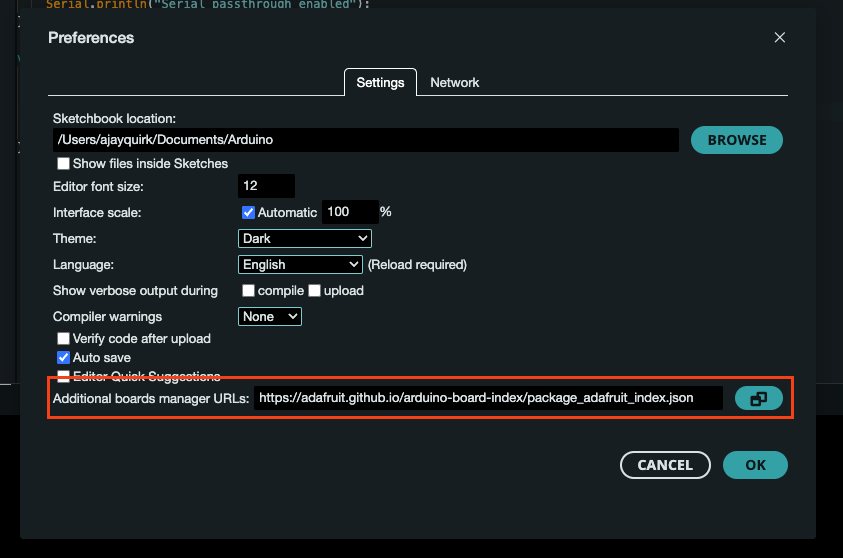

# Build Tutorial for SNR based GNSS Reflectometry (GNSS-R) Project

## Contributors
- [Baxter Pollard](mailto:baxter.b.pollard@gmail.com)
- [Ajay Quirk](mailto:quirkajay@myvuw.ac.nz)
- [Craig Jefferies](mailto:jefferiesc@mtaspiring.school.nz)
- [Delwyn Moller](mailto:delwyn.moller@auckland.ac.nz)
- [Brain Pollard](mailto:bpollard@restorelab.co.nz)

Last updated on the 24th of January 2025

Based on Fagundes, M.A.R., Mendonça-Tinti, I., Iescheck, A.L. et al. An open-source low-cost sensor for SNR-based GNSS reflectometry: design and long-term validation towards sea-level altimetry. GPS Solut 25, 73 (2021). https://doi.org/10.1007/s10291-021-01087-1

## Table of Contents
- [Parts](#parts)
- [1. Arduino Firmware](#1-arduino-firmware)
  - [1.1 Arduino IDE Setup](#11-arduino-ide-setup)
# Parts
The parts list can be found on DigiKey here: https://www.digikey.co.nz/en/mylists/list/PICEBQ9ABU

# 1. Arduino Firmware
## 1.1 Arduino IDE Setup
Download the latest version of the Arduino IDE from here: https://www.arduino.cc/en/software

Then open arduino settings and add the following URL under "Additional boards manager URLs": https://adafruit.github.io/arduino-board-index/package_adafruit_index.json and click "OK". If you already have an URL in the board manager add a comma at the end and then paste the URL.

    
    

Once you have installed the board JSON file you can now install the board group from the Board Manager. To do this click the second icon in the sidebar and search for "Adafruit SAMD". The board group you want to install is called "Adafruit SAMD Boards by Adafruit-", install the latest version of this.

