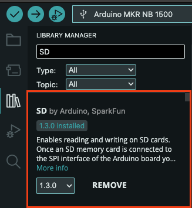
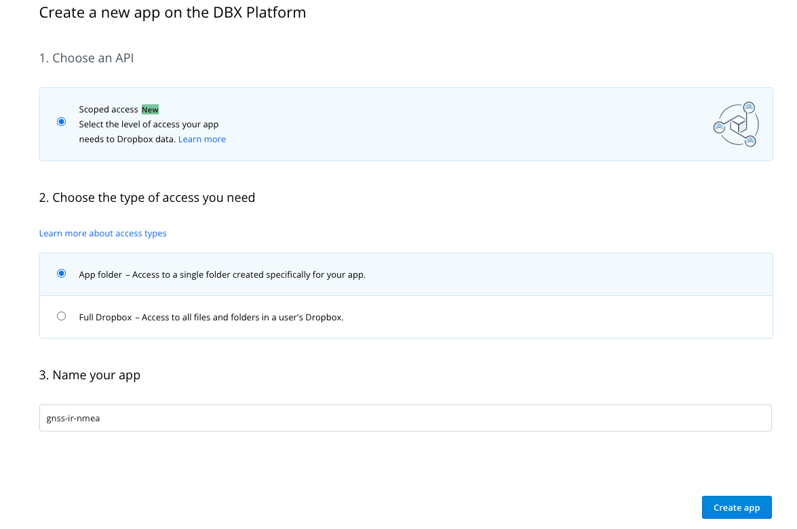
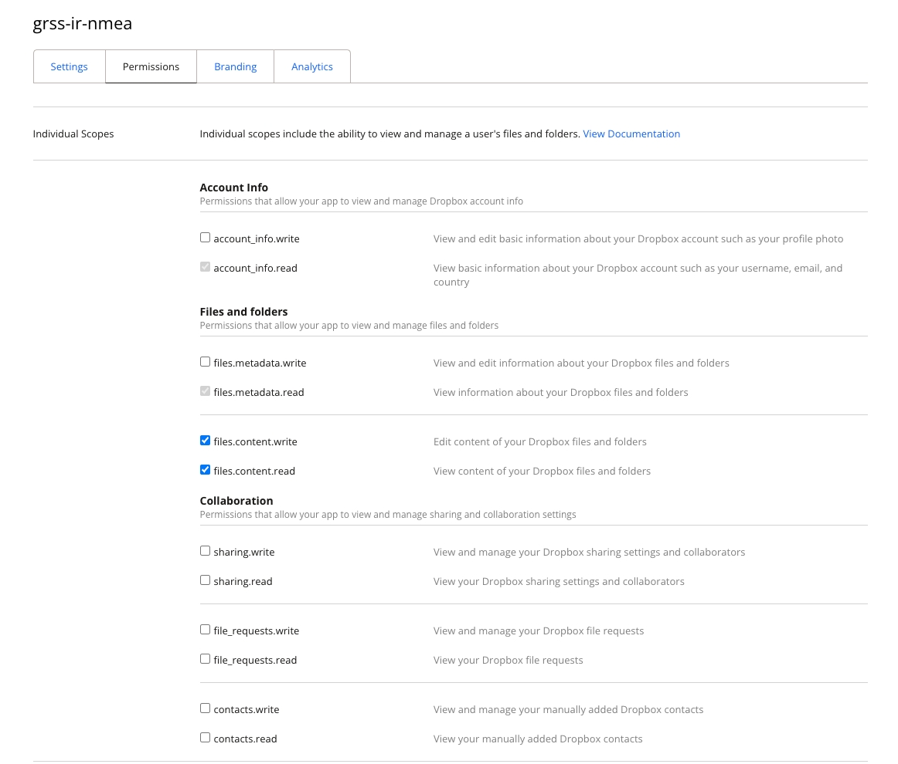
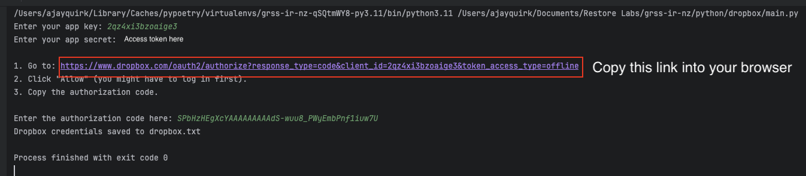
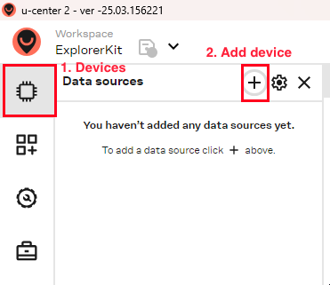
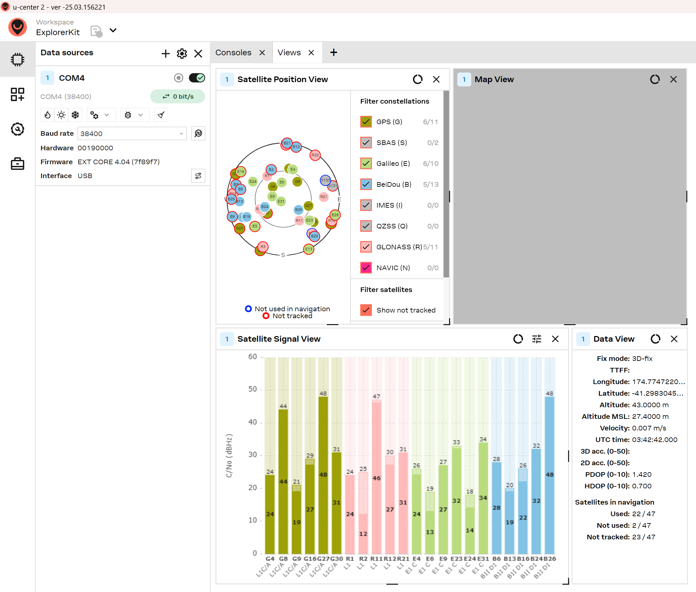
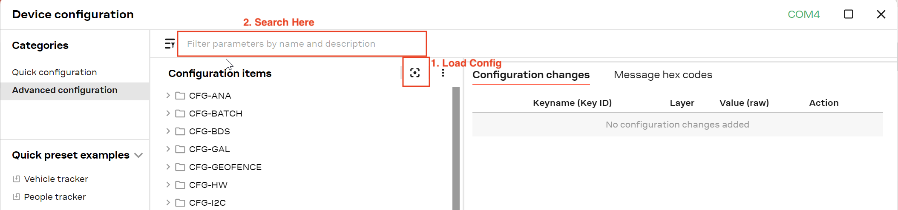
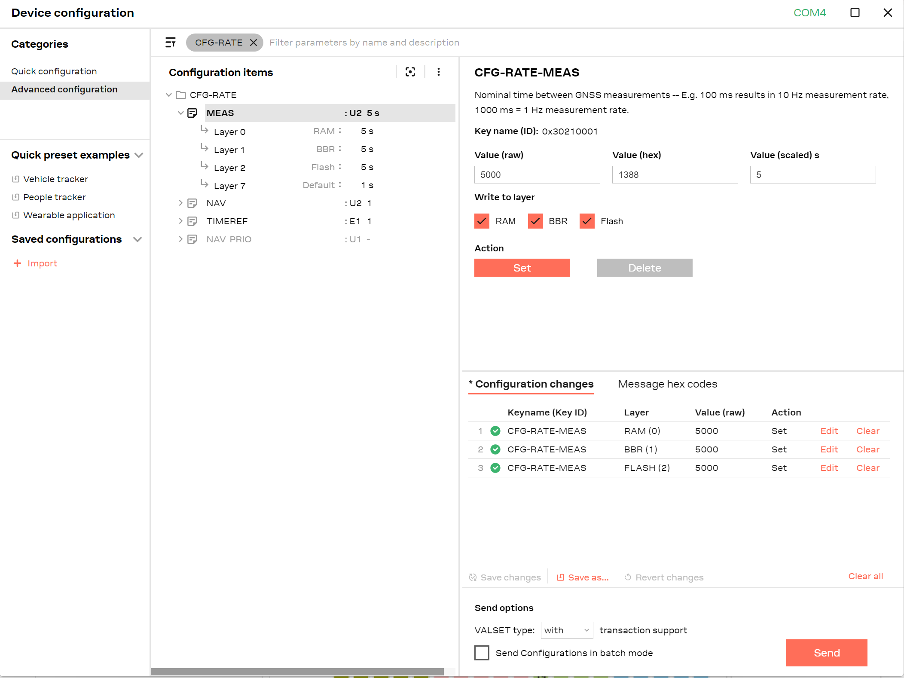

# Build Tutorial for SNR based GNSS Reflectometry (GNSS-R) Project

## Contributors
- [Baxter Pollard](mailto:baxter.b.pollard@gmail.com)
- [Ajay Quirk](mailto:quirkajay@myvuw.ac.nz)
- [Craig Jefferies](mailto:jefferiesc@mtaspiring.school.nz)
- [Delwyn Moller](mailto:delwyn.moller@auckland.ac.nz)
- [Brain Pollard](mailto:bpollard@restorelab.co.nz)

Last updated on the 11th of May 2025

Based on Fagundes, M.A.R., Mendonça-Tinti, I., Iescheck, A.L. et al. An open-source low-cost sensor for SNR-based GNSS
reflectometry: design and long-term validation towards sea-level altimetry. GPS Solut 25, 73 (2021).
https://doi.org/10.1007/s10291-021-01087-1

## Table of Contents
- [Parts](#parts)
- [1. Arduino Firmware](#1-preparing-arduino)
  - [1.1 Arduino IDE Setup](#11-arduino-ide-setup)
  - [1.2 Format the SD Card](#12-format-the-sd-card)
  - [1.3 Get the firmware](#13-get-the-firmware)
  - [1.4 Dropbox Key](#14-dropbox-key)
  - [1.5 Uploading the Firmware](#15-uploading-the-firmware)
  - [1.6 C++ Definitions](#16-c-definitions)
- [2. Connecting the Electronics](#2-connecting-the-electronics)
  - [2.1 Connecting the Arduino and SD Shield](#21-connecting-the-arduino-and-sd-shield)
  - [2.2 Connecting the Arduino and GPS Module](#22-connecting-the-arduino-and-gps-module)
  - [2.3 Cellular Connection](#23-cellular-connection)
  - [2.4 Preparing the Power System](#24-preparing-the-power-system)
- [3. Mounting the system](#3-mounting-the-system)
- [4. Testing the system](#4-testing-the-system)
  - [4.1 Activity LEDs](#41-activity-leds)
  - [4.2 Serial Monitor](#42-serial-monitor)
  - [4.3 Data Files](#43-data-files)
# Parts
The parts list can be found here: https://github.com/AjayACST/grss-ir-nz/tree/main/tutorial/parts-list.xlsx

# 1. Preparing Arduino
You will need:
1. Arduino MKR NB 1500
2. Micro SD Card

## 1.1 Arduino IDE Setup
Download the latest version of the Arduino IDE from here: https://www.arduino.cc/en/software

The first thing to do is install the board group from the Board Manager. To do this click the second icon in the sidebar
and search for "Arduino SAMD". The board group you want to install is called "Arduino SAMD Boards (32-bits ARM Cortex-M0+)",
install the latest version of this.


You can then install the library that we will need for this project. We will need the MKRNB library which handles
communication between the cellular network and our device. To do this click the library icon below the boards manager
and search for MKRNB and install it. You will also need to install the SD library, which handles communication with the SD card,
and the ArduinoHttpClient, which handles the HTTP requests to Dropbox. To do this search for "SD" and "ArduinoHttpClient" and install




## 1.2 Format the SD Card

Before you can use the SD card with the Arduino you will need to format it. The link below has instructions on how to do
this for both Windows and MacOS. Ensure that the SD card is formatted as FAT32 so that the Arduino can read it.
https://support.garmin.com/en-NZ/?faq=QqSbC0YZTz57kLm7uRQxZ7

## 1.3 Get the firmware
Now that we have the board group and library installed we can upload the firmware to the Arduino. To do this create a
new sketch and copy the code found <a href="https://github.com/AjayACST/grss-ir-nz/blob/main/arduino-code/src"> in the
`main.cpp` file here</a> into the sketch. You will also need to copy or download the files `dropbox.cpp`, `dropbox.h`,
`main.h`, `arduino_secrets.h.example` (see note below) into their own files as well. You can do this by copying the file
in GitHub, then click the three dots near the top right of the arduino IDE and then "New File".
Call the file the same as the file you are copying, you can then paste the code into the new file.
You will need to do this for all three files.

When copying the `arduino_secrets.h.example` file remove the `.example` so you should have a file called `arduino_secrets.h`.
In this file you will need to type in your sim providers APN, if you are using Spark you can leave this as `m2m`.
For the dropbox app key and secret follow the guide below. [1.4 Dropbox Key](#14-dropbox-key).

## 1.4 Dropbox Key
To get a dropbox API key you will need a Dropbox account, and to create an app. To create an app go https://dropbox.com/developers
and click the "Create App" button and sign in to your account if prompted. Then select "Scoped Access" and "App folder", then
give your app a name, you can call this anything you want.



Once you have created the app you will be taken to the app, click on 
"Permissions" in the bar below the app name and add the `file.content.write` and `file.content.read` permissions.
Click "Submit" to save the changes.



Then go back to the settings page and scroll down to the OAuth 2 section. Here you will find your app key and secret
(you will need to click 'show' to copy the app secret). Copy these into the `arduino_secrets.h` file in the
`#define DROPBOX_APP_KEY` and `#define DROPBOX_APP_SECRET` lines. You will also need to generate a first time dropbox
access token, using the python script found on the GitHub: https://github.com/AjayACST/grss-ir-nz/blob/main/python/dropbox/main.py

To run this you will need Python 3 installed and the `dropbox` library. You can install this by running
```bash
pip install dropbox
```
Then run the script by running the command below in the terminal
```bash
python main.py
```
You may need to call python3 instead of python depending on your system. The script will ask you to paste in your
app key and app secret, it will then give you a URL to open in your browser. This will ask you to log in to your dropbox
account and will give you a code to copy. Copy this code and paste it into your terminal. If all has worked, after a few
seconds you should see a message saying "Dropbox credentials saved to: ..." and a file called dropbox.txt created in the
same directory as `main.py`. You will need to copy this file onto your SD card after formatting it.



## 1.5 Change GPS Output Rate
The GPS module will output data at a rate of 1Hz by default. This will create a massive amount of data that is not 
needed for this project. Therefore we will need to change the output rate to 0.2Hz (5 seconds). To do this you will need
a windows computer and the u-Center software. You can download this from the u-Blox website here: https://u-blox.com/u-center
, download u-Center 2.0. Once you have installed and opened u-Center you will need to connect the GPS module, if you are
using the Sparkfun NEO-M9N from the parts list you can do this by plugging a USB-C cable into the module and your computer.
Then click the "devices" icon and then the plus button.



Then select the COM port that the GPS module is connected to, this will be the one that is not the Arduino, and click 'Connect'.
Assuming everything has connected correctly, and your GPS module has a FIX on some satellites you should see a screen like the one below.



This screen shows all the parsed raw data that is collected from the GPS module. Now click the settings button beside the 
plus icon you used to add the module. In the window the comes up click the button indicated below to load in the current
module configuration. Then search for "CGF-RATE" in the search bar.



Then click the "CFG-RATE" option in the list, then the MEAS command. This will bring up the settings panel on the side,
under "Value (scaled) s" change this to 5, then tick the boxes for "RAM", "BBR" and "Flash". Then click the "Set" button
and then "Send". Assuming everything has worked you should see 3 green ticks beside the 3 rows added to the table when you
clicked "Set".



You can now close out of u-Center and unplug the GPS module from your computer.

## 1.6 Install Cellular Library

You will need to install one more library before uploading the firmware. To do this download this zip file of code:
https://github.com/techstudio-design/SimpleNB/archive/refs/heads/master.zip and in your Arduino IDE click the "Sketch"
button in the toolbar and then "Include Library" -> "Add .ZIP Library". Then select the zip file you just downloaded.
This will install the library needed for cellular communcation. Once you have done this check everything compiles by
clicking the "tick" icon in the top left of the Arduino IDE. If you have done everything correctly it should compile and
you can move on to the next step!

## 1.7 Uploading the Firmware

Now plug the Arduino into your computer and select the board group that we installed earlier. Then select the board
from the board selector beside the upload button. It should be indicated as "Arduino MKR NB 1500". If it is not go to
Tools -> Board -> Arduino SAMD Boards (32-bits ARM Cortex-M0+) and select the Arduino MKR NB 1500. You can then click
the Upload button, Right Arrow Icon, to upload the firmware to the Arduino.

## 1.8 C++ Definitions
At the top of the file below the #include directives there are a few definitions that you can change if you have some
different configs

- `#define GPS_BAUD 38400` default baud rate for the u-Blox NEO-M9N GPS module, only change if using a different module
- `#define SERIAL_BAUD 9600` baud rate for the serial monitor, only change if you want to change the speed of the serial monitor.
- `#define IDLE_THRESHOLD 10` threshold for no output from GPS module to be considered "idle". In milliseconds.
- `#define SDCard 4` SD card chip select pin, only change if not using the MKR SD Shield.
- `#define WAIT_FOR_VALID_GPS` comment out if you want to start recording data immediately, even if the GPS module is not ready.
- `#define MAX_BASENAME_LEN (8+1)` maximum length of the basename of the log files
- `#define MAX_FILENAME_LEN (MAX_BASENAME_LEN+1+3)` maximum length of the log file name including extension
- `#define DEBUG` comment out if you want to disable debug messages, recommend to comment out when confirmed working.
- `#define GPS_BUFFER_SIZE_TYPICAL 512` typical size of the GPS nmea, used for buffer pre-allocation


# 2. Connecting the Electronics

## 2.1 Connecting the Arduino and SD Shield
You will need:
1. Arduino MKR NB 1500
2. Micro SD Card
3. Arduino MKR SD Shield
4. Header Pins
5. Breadboard

Start by plugging the SD Shield into the Arduino. To do this simply line the pins
up on the SD shield to the pins on the NB 1500 and push them together. The pins should line up with the headers on the
Arduino as shown below. As a general guide the SD card slot should face away from the micro USB port on the Arduino.


## 2.2 Connecting the Arduino and GPS Module
You will need:
1. Arduino MKR NB 1500
2. Sparkfun NEO-M9N GPS Module
3. Breadboard
4. Jumper Wires
5. GNSS Antenna

To connect the GPS Module to the Arduino you will first need to solder the header pins to the GPS Module. To do this cut
the header pins to the correct length and solder them to the GPS module. The pins should be
soldered to the empty row that is on the USB port side of the PCB.
Then put the header pins into the breadboard so that the longer side of the pins goes into the breadboard, then place
the SD Shield on top of the header pins. You can then solder the header pins to the SD Shield.


Once it has been soldered you can plug the GPS Module and Arduino into the breadboard. To do this place the Arduino on
one end of the breadboard and the GPS module on the other end. Ensuring that none of the pins from the GPS Module are
connected to the same tracks that the Arduino is on. You can then connect the two devices using jumper wires.


The first image shows an example of bad placement of the board and GPS module.

The connections are as follows:
- GPS Module VCC -> Arduino 3.3V
- GPS Module GND -> Arduino GND
- GPS Module RX -> Arduino TX
- GPS Module TX -> Arduino RX

You can then connect the GNSS Antenna to the GPS Module. To do this plug the GNSS Antenna into the SMA connector on the
GPS Module. This is the big gold connector on the side of the board, to connect it simply screw the antenna onto the connector.


## 2.3 Cellular Connection


<span style="color:red">Add in info about how to get sim card</span>

To start break the first layer of the sim card off so that you are left with the second-biggest size, the Micro Size.
Then plug the sim card into the sim card slot on the back of the Arduino. The sim card slot is on the back of the board
at the opposite end to the micro USB port. The sim card should be inserted with the gold contacts facing up.

Then plug the Laird antenna into the U.FL connector on the Arduino. This is the small circle connector on the front of
the board, above the Sim card slot. This connector can be a bit tricky to plug in, so be careful when plugging it in. It
can also come out easily so we would recommend using a small amount of hot glue or tape to hold it in place once you have
confirmed that everything is working.
<span style="color:red">Add photo of completed board</span>

## 2.4 Preparing the Power System

<span style="color:red">Euan to write or give information for me to write this up</span>

# 3. Mounting the system

<span style="color:red">Craig to write or give information for me to write this up</span>

# 4. Testing the system
## 4.1 Activity LEDs
There is a red LED on the Arduino that will blink every time data is written to the SD card. Ensure that this is
flashing to make sure that data is saved. There is also a LED on the GPS module that will blink once a second when it
has a fix. This means that it has a connection to the satellites and is ready to record data. The red LED on the arduino
will only start to blink once the GPS module has a fix.

<span style="color:red">Add photo highlighting these LEDs</span>

## 4.2 Serial Monitor

You can also check that the NMEA sentences look correct through the serial monitor. To do this follow the steps for
plugging the arduino into the computer from [1.3 Uploading the Firmware](#13-uploading-the-firmware).
Then open the serial monitor by clicking the magnifying glass icon in the top right of the Arduino IDE. The baud rate
should be set to 9600.

<span style="color:red">Add photo of serial monitor showing NMEA sentences</span>

## 4.3 Data Files
The files that are saved to the SD Card will have an .log extension. The file names will look like the below photo:


Where the first two digits are the year, the second two digits are the month, and the last two digits are the day.
This date is in UTC.

The data in the file should look like the below example

```txt
$GNGGA,000018.000,4443.0117,S,16910.7100,E,2,17,0.65,345.2,M,6.1,M,,*5E
$GPGSV,3,1,12,03,62,297,48,26,59,075,49,31,58,126,48,04,52,236,43*7D
$GPGSV,3,2,12,16,40,018,44,28,25,119,42,50,23,307,40,09,14,243,40*7A
$GPGSV,3,3,12,06,09,222,46,29,06,131,38,195,06,330,27,194,,,25*45
$GLGSV,2,1,08,80,79,002,43,70,71,203,35,79,40,142,43,69,37,054,46*69
$GLGSV,2,2,08,73,23,330,43,71,20,221,39,87,08,197,24,86,05,244,33*67
$GNRMC,000018.000,A,4443.0117,S,16910.7100,E,0.03,0.00,310524,,,D*6A

$GNGGA,000028.000,4443.0117,S,16910.7099,E,2,17,0.65,345.3,M,6.1,M,,*5D
$GPGSV,3,1,12,03,62,297,48,26,59,075,49,31,58,126,48,04,52,236,43*7D
$GPGSV,3,2,12,16,40,018,44,28,25,119,42,50,23,307,40,09,14,243,38*75
$GPGSV,3,3,12,06,09,222,45,29,06,131,38,195,06,330,24,194,,,25*45
$GLGSV,2,1,08,80,80,003,43,70,71,203,34,79,39,142,43,69,37,054,46*61
$GLGSV,2,2,08,73,24,330,42,71,20,221,33,87,08,197,24,86,05,244,32*6A
$GNRMC,000028.000,A,4443.0117,S,16910.7099,E,0.01,0.00,310524,,,D*6A
```